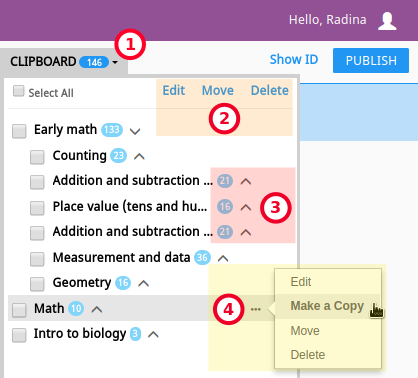

.. _add_content:

Add Content to Channels
#######################

Before you start building content channels in Kolibri Studio, you should dedicate some time to plan the channel structure and how should the topics be organized - by subject, source, learner's age, etc. Use the checklist in the :ref:`Appendix <appendix>` to help you plan. 

.. TODO - cross-link with relevant documents from the EdToolkit.

Structure of Content Channels
=============================

Content Channel is a collection of content and `metadata <https://en.wikipedia.org/wiki/Metadata>`_ organized into a topic tree structure. For example, the Khan Academy channel has 4 levels of nested topics:

| **Domain > Subject > Topic > Tutorial**
| *e.g. Math > Arithmetic > Fractions > Comparing fractions*
|
Content channel aligned to a specific state curriculum might instead be structured as:

| **Grade > Subject > Unit**
| *e.g. Fifth Standard > Math > Unit 5*
|
Channel Topic Tree
******************

Inside each content channel the individual learning resources (exercises, videos, audio or document files) are organized in groups of related resources in a structure called a **channel topic tree**, similar to how files are organized in folders on a computer.

Think of the topics as folders that can contain other sub-folders (sub-topics) or files (learning resources) directly. A folder in the topic tree can contain both individual resources and sub-folders.

   .. figure:: img/cc-topic-subtopic-resources.png
      :alt: Topic > Sub-topic > Resource structure of the Khan Academy Math channel.

      Topic > Sub-topic > Resource structure of the Khan Academy Math channel.

There is no inherent restriction on the depth of topic trees or the number of resources that you can place in a channel. However, you should take into consideration the intended learning pathway and user experience once channel is imported in Kolibri, and try to build your topic tree so that learners do not need to click through long series of subfolders to arrive to the desired learning resource.

.. _edit_content_tools:

Edit Channel Content Tools
==========================

   .. figure:: img/edit-channel-content-tools.png
      :alt: Edit Channel Content Tools

      Edit Channel Content Tools

#. Channel Content Toolbar contains:

   a. :ref:`Edit selected content details <edit_content>` ( |pencil| icon)
   b. :ref:`Copy selected content into clipboard <copy_content>` (|copy| icon)
   c. :ref:`Move selected content items from one topic to another <move_content>` (|move| icon)
   d. :ref:`Delete selected content <delete_content>` (|trash| icon)
   e. :ref:`Sync imported content <sync>` (|sync| icon)
   f. :ref:`Invite collaborators <invite_collaborators>` (|user| icon)
   g. Hide details for all content topics (when checked, only topic titles will be displayed)

#. Return to **My Channels** page (|home| icon)
#. Channel selector dropdown menu
#. Channel ID/token number
#. Indicator for changes in channel pending to be published
#. :ref:`Clipboard <clipboard>` button (with the indicator of available content items)
#. Topic container pane
#. |plus-c| **ADD** button to :ref:`add topics <add_topics>`, :ref:`upload content <upload>`, and :ref:`create exercises <exercises>`.

.. _add_topics:

Add Topics to Channel
=====================

To create a new topic in a content channel, follow these steps.

#. Click |plus-c| **ADD** button.
#. Select **Add Topics** option.

   .. figure:: img/add-topics.png
         :alt: Add Topics

         Add Topics

#. Complete the topic information and metadata, and click **APPLY CHANGES** button.

   .. tip:: Use the checkboxes on the left to select topics, edit and change details or metadata, or |close| buttons to delete topics in this same window, and remember to click the **APPLY CHANGES** afterward.

#. Click |plus-c| **ADD TOPIC** button on the left side to add more topics.

   .. figure:: img/edit-topics.png
      :alt: Edit topic details and add metadata.

      Edit topic details and add metadata.

#. Click **SAVE & FINISH** to save changes and return to the previous page.

Add Subtopics
*************

To add further subtopics to any of the topics or subtopics you created you can either:

* Click |plus-c| **ADD** button at the bottom, and select **Add Topics** option.

**OR**

* Hover over the topic, click the |ellipsis| button for more options and select **Add Subtopic**.

   .. figure:: img/add-subtopics.png
      :alt: Add subtopics to channel topics.

      Add subtopics to channel topics.

Depending on how deep your topic tree is, there may be several levels that look like this:

   .. figure:: img/subtopics.png
      :alt: Topics can have several levels of subtopics.

      Topics can have several levels of subtopics.

Keep in mind that you can create channels with mixed content, by importing content from multiple public channels and adding and uploading content of your own.

.. tip:: You can move topics, subtopics and individual learning resources from one level to another by drag-and-drop.

.. _upload:

Upload Files
============

Currently allowed file formats for individual learning resources are:

-  :ref:`MP4 - video files <video>`
-  MP3 - audio files
-  :ref:`PDF - document files <pdf>`
-  :ref:`ZIP - packaged HTML5 <html5>`
-  ePUB - ebook files

.. warning:: There is an initial storage limit of **500MB** for the files that you upload to Kolibri Studio. If you require more storage, please contact info@learningequality.org. You can :ref:`keep track of the used storage <settings>` in the **My Settings > Storage** page.

To upload individual learning resources into your content channel, follow these steps.

#. Click |plus-c| **ADD** button.

#. Select **Upload Files** option.

   .. figure:: img/upload-files.png
         :alt: Upload Files option.

         Upload Files option.

#. Click **ADD FILES** button or drag and drop the files inside the window.

   .. figure:: img/add-more-files.png
         :alt: Add individual learning resources to content channel.

         Add individual learning resources to content channel.

   .. note:: There is no general ideal size for each individual upload, and upload times and ideal number of content items per upload will largely depend on the available Internet connection.

#. While uploading files, the system extracts some file information like filenames and thumbnails for videos. Once the upload is finished, you can change the name of the file, add lower/higher resolution option, and captions for videos:

   .. figure:: img/edit-upload.png
         :alt: Change or add file details.

         Change or add file details.

#. You can also delete extracted thumbnails, generate them from content, or upload your own:

   .. figure:: img/generate-thumbnails.jpg
         :alt: Generate thumbnails from content.

         Generate thumbnails from content.

#. Click **EDIT METADATA** button to proceed.

   .. tip:: Adding the **appropriate metadata** to each content item, and following the **consistent style for filenames and tags** will impact the search functionality, and you should keep it in mind in order to ensure the findability of the learning resources included in your channels. 

#. Select each file on the right side to edit the respective metadata. 

   .. figure:: img/edit-metadata.png
         :alt: Add metadata to files.

         Add metadata to files.

   .. tip:: Tags used previously will appear below the field when you start typing, so you can easily select and reuse them when appropriate.

   .. warning:: Remember to select the `appropriate license <https://creativecommons.org/choose/>`_ in case you are adding files to a content channel that you plan to release publicly. 
      
      You can select a **Special Permissions** license field to customize the description or in cases where the available licenses do not match the content permissions.

         .. figure:: img/add-special-permissions.png
               :alt: Add Special Permissions license.

               Add Special Permissions license.

#. Click **APPLY CHANGES** button to save the intermediate changes.
#. Click **SAVE & FINISH** to return to the main channel content page.

.. _video:

Video files
***********

.. tip:: **Recommendations for upload of video files**

         There is no limit to video resolution or file size set by Kolibri Studio platform itself. However, keep in mind that the total channel size will impact the experience of the Kolibri administrator who will have to import and update it on the local Kolibri installation, and the size of the individual videos will impact the experience of the learners viewing it using Kolibri. Therefore, **prefer smaller and low resolution video files**.  

Additionally, you can add subtitles to videos, set the language, and preview them prior to publishing.

   .. figure:: img/captions.png
      :alt: Add captions to videos.

      Add captions to videos.

.. _pdf:

PDF files
*********

It is recommendable that documents in PDF format are also uploaded in small digestible chunks, for examples up to 20 pages at a time. 

If you are including bitmap images into the PDF documents, try to optimize them and reduce their size prior to exporting the final PDF file.

.. _html5:

HTML5 Applications
******************

Kolibri Studio supports a special **HTML5 App** content format, which allows for rich, dynamic content such as games, interactive documents, and simulations. The format consists of a **ZIP** file containing HTML5 resources such as HTML, CSS, and JS files. These resources will be rendered within an *inline frame* in the Kolibri application.

.. tip:: **Guidelines for structure of the HTML5 apps**

   * There must be an **index.html** file at the top level within the ZIP file.
   * All resources referenced from HTML pages must be relative, pointing to files within the ZIP file — not online sources.
   * JavaScript is allowed, but some features (e.g. popup windows, alerts) are disabled.
   * Video files (mp4) should be progressive download and no more than 480p resolution.
   * Audio files (mp3) should not exceed 128kb bit rate.

.. _exercises:

Create Exercises
================

In Kolibri you can create exercises that contain a set of interactive questions (numeric, multiple choice, check all that apply, or true or false) that learners can engage with. With exercises, learners will receive instant feedback on whether they answer each question correctly or incorrectly. For each exercise you can set the mastery criteria, and Kolibri will cycle through the available questions in an exercise until learners achieve mastery. It is also possible to set the question/answer/hint order, indicate whether to randomize the order of questions/answers, and add images and formulas to questions, answers, and hints.

Mastery Criteria
****************

Kolibri marks an exercise as completed when learners meet the mastery criteria. Here are the different types of mastery criteria for an exercise:

+----------------------------------------------------------------------------------+
| Criteria explained                                                               |
+====================+=============================================================+
|**2 in a row**      |Learner must answer two questions in a row correctly         |
+--------------------+-------------------------------------------------------------+
|**3 in a row**      |Learner must answer three questions in a row correctly       |
+--------------------+-------------------------------------------------------------+
|**5 in a row**      |Learner must answer five questions in a row correctly        |
+--------------------+-------------------------------------------------------------+
|**10 in a row**     |Learner must answer ten questions in a row correctly         |
+--------------------+-------------------------------------------------------------+
|**100% Correct**    |Learner must answer all questions in the exercise            |
|                    |correctly (not recommended for long exercises)               |
+--------------------+-------------------------------------------------------------+
|**M out of N**      | Learner must answer M questions correctly from the last N   |
|                    | questions answered (e.g. 3 out of 5 means learners need to  |
|                    | answer 3 questions correctly out of the 5 most recently     |
|                    | answered questions)                                         |
+--------------------+-------------------------------------------------------------+

To create an exercise, follow these steps.

#. Click |plus-c| **ADD** button.
#. Select **Create Exercise** option.

   .. figure:: img/create-exercise.png
         :alt: Select Create Exercise option.

         Select Create Exercise option.

#. Edit the exercise in the **Details** tab to:

   a. Add/Change the thumbnail 
   b. Set the exercise title 
   c. Select the mastery criteria 
   d. Fill in the copyright information and add tags

   .. figure:: img/create-exercise-detail.png
         :alt: Options in the exercise Details tab.

         Options in the exercise Details tab.

#. Use the **Questions** tab to:

   a. Select the answer type (single/multiple, true/false or numeric input)
   b. Provide answers for each question 
   c. Provide hints for each question
   d. Randomize answer order

   .. figure:: img/edit-content-questions.png
         :alt: Exercise Questions tab options.

         Exercise Questions tab options.

#. Click the |plus| **QUESTION** button to add a new question to the exercise. Question editor field offers similar options as a basic text editor. You can format the text to be bold, add image files, undo and redo actions.

   .. figure:: img/question-editor.png
         :alt: Question field editor.

         Question field editor.

   .. tip:: You can resize images by selecting them and dragging the corners to achieve the desired size.

#. Click the |plus| **ANSWER** button to add answer(s) to the question. Answer editor field offers the same formatting options as the Question editor. 

   .. figure:: img/answer-editor.png
         :alt: Answer field editor.

         Answer field editor.

   Keep clicking the |plus| **ANSWER** button to add as many answers as you want for the single and multiple selection types of questions.

   .. warning:: Remember to activate the radio button for the correct answer (outlined in the image above).

#. Click **HINTS** |external| to open the Hint editor window.

#. Click |plus| **HINT** to add hints for the question. Hint editor field offers the same formatting options as the Question and Answer editors.

   .. figure:: img/hint-editor.png
         :alt: Hint editor field.

         Hint editor field.

   Keep clicking the |plus| **HINT** button to add as many hints as you want for the question.

   .. tip:: You can delete and reorder answers and hints with the |sort| |close| icons in the upper right corner.

   .. figure:: img/reorder-answers.png
         :alt: Reorder questions and hints.

         Reorder questions and hints.

#. Use the **Prerequisite** tab to recommend the required videos and/or exercises that the learner should finish prior to the current one:

   .. figure:: img/edit-content-prerequisites.png
         :alt: Add Prerequisites for the current exercise.

         Add Prerequisites for the current exercise.

#. Click **APPLY CHANGES** button to save the intermediate changes.
#. Click **SAVE & CLOSE** when you finish editing to return to the topic view.

   .. figure:: img/final-question.png
         :alt: Review final question display.

         Review final question display.

.. _import_content:

Import Content from Other Channels
==================================

To import content from other channels, either those previously published or those that are publicly available, follow these steps.

#. Click |plus-c| **ADD** button.
#. Select **Import from Channels** option. 

   .. figure:: img/import-from-channels.png
         :alt: Import content from other channels.

         Import content from other channels.

#. Select the content you want from **Import from Other Channels** dialog. This window will display all the channels that you can import content from. You can select the whole topics or individual resources to import. The total size and number of the resources you are importing is displayed in the summary at the bottom of the dialog.

#. Use the **Search** field to look for a specific topic or resource among the available channels.

   .. figure:: img/import-search.png
      :alt: Import Content from Channels with Search option.

      Import Content from Channels with Search option.

#. Click **CONTINUE** to review the selected resources.

   .. figure:: img/review-import.png
      :alt: Review the number and size of the selected resources.

      Review the number and size of the selected resources.

   .. tip:: Ypu can use the **Back** link to return to the full resources list, but you will loose the current selection.

#. Click **IMPORT** when you are done to return to the main channel content page.

   .. warning:: The server’s capacity per import is currently approximately 100 content items. When importing over 100 content items, you will need to import in multiple chunks. The number highlighted in blue next to each checked section indicates the number of content items in that section.

   .. tip:: Remember to :ref:`publish the channel <publish_channel>` each time you make changes or updates to channel content.
      
      If you encounter ``Asynchronous sync...`` error while importing, reload the page and reduce the number of items to import.

.. _clipboard:

Use the Clipboard to Import Content
***********************************

Another option for copying content between channels is to use the **Clipboard**.

   Tools and indicators in the clipboard tab.

#. Open the **Clipboard** button (indicator displays the number of content items inside).
#. Buttons to edit, move and delete content items from the clipboard.
#. Indicators for number of content items inside each topic.
#. Hover and click the |ellipsis| to access the menu to edit/move/delete the selected content item.

.. _copy_content:

To import content into clipboard, follow these steps.
^^^^^^^^^^^^^^^^^^^^^^^^^^^^^^^^^^^^^^^^^^^^^^^^^^^^^

1. Open the channel that contains topics or content items you wish to import.
2. Select the topics or content items to copy.
3. Use the |copy| button from the :ref:`Edit Channel Content Toolbar <edit_content>`.

To import content from clipboard, follow these steps.
^^^^^^^^^^^^^^^^^^^^^^^^^^^^^^^^^^^^^^^^^^^^^^^^^^^^^

1. Open the destination channel.
2. Open the clipboard.
3. Drag and drop any topic or individual content items into the appropriate topic or subtopic of the destination channel.

.. _sync:

Syncing Imported Content
************************

Content imported from other channels can change over time. Use the **Syncing content** option to update any imported content with their original source content. Content features that can be updated include resource files (videos, assessment items, tags, title and description details, etc.). To sync imported content follow these steps.

1. Click the |sync| button in the :ref:`Edit Channel Content Toolbar <edit_content>`.
2. Select which fields you want to sync.
3. Click the **SYNC** button to proceed, or **CANCEL** to exit without syncing.

   .. figure:: img/sync-content.png
      :alt: Sync imported content to keep it up-to-date.

      Sync imported content to keep it up-to-date.