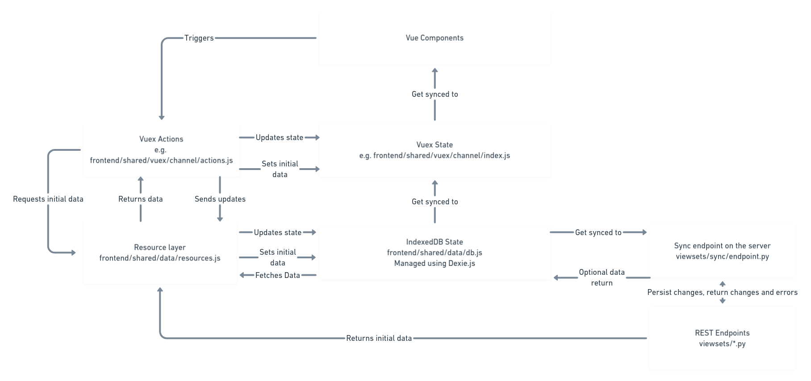

# Studio Architecture

*N.B.* This document provisionally describes the basic framework that has been put in place. It does not comprehensively describe everything about the current Studio codebase.

## External documentation

* [Vue](https://vuejs.org/v2/guide/)
* [Vue Router](https://router.vuejs.org/guide/)
* [Vuex](https://vuex.vuejs.org/guide/)
* [IndexedDB](https://developer.mozilla.org/en-US/docs/Web/API/IndexedDB_API)
* [Jest](https://jestjs.io/docs/en/getting-started)
* [Django](https://docs.djangoproject.com/en/1.11/)
* [Django Rest Framework](https://www.django-rest-framework.org/tutorial/quickstart/)
* [Postgresql](https://www.postgresql.org/docs/)

## Frontend Architecture

Studio is currently divided into multiple single-page-applications - each one has a distinct function and purpose. It is plausible that one day, this will be collapsed into one SPA to rule them all, but today is not that day.

Examples of SPAs in Studio are:

* Channel List - responsible for showing over all listings of channels under different categories (public, editable, etc.) and also for creating new channels, and creating and editing collections of channels.
* Channel Edit - responsible for showing the contents of an individual channel and allowing a user with the appropriate permissions to edit the contents and structure of that channel, it is the primary workhorse of the Studio user interface.
* Accounts - responsible for creating accounts, logging in, "forgot password" functionality, and other related items
* Administration - an admin only page that allows people with staff privileges to see extensive information about user accounts, user created channels, and other detailed information in order to support users in using Studio.
* Settings - allows a user to modify their user account settings, this could potentially be included in the other SPAs rather than having its own SPA.

## Where does the frontend code live?

Most frontend code lives under [`contentcuration/contentcuration/`](../contentcuration/contentcuration/). Paths referenced below are relative to this directory.

Each SPA has its own dedicated Django template that sets up the environment for the SPA. The templates for these can be found in [`templates`](../contentcuration/contentcuration/templates)


All code for SPAs should live in `frontend/<spaName>`. For example, the Channel List code lives in: [`frontend/channelList`](../contentcuration/contentcuration/frontend/channelList)

Code that is common across multiple SPAs is in the [`frontend/shared`](../contentcuration/contentcuration/frontend/shared) folder. This can be referenced with the [Webpack](https://webpack.js.org/concepts/) alias `shared/...` in ES6 imports.

(Note: currently, some code is still housed inside [`static/js`](../contentcuration/contentcuration/static/js). This should be migrated into the `frontend` folder as soon as possible. As a temporary convenience during this migration, anything in the frontend folder can also be referenced with `frontend/...`. Relative imports are to be preferred within the SPA folders.)

By convention, within each of the `frontend` sub-folders:

* `index.js` contains code to initialize the Vue application
* `router.js` stores client-side [Vue Router](https://router.vuejs.org/guide/) routes
* The `pages` directory contains components associated with routes
* The `components` directory contains components shared across multiple pages in the SPA. (Components that are only used within a single page should go in a sub-directory for that page.)
* If there are any custom layouts for the SPA, they would go in a `layouts` directory
* Vuex modules are stored in the `vuex` folder and the store is initialized in `store.js`

Tests should be defined in line with Jest conventions inside a folder named `__tests__` inside the same folder as the code they are testing. This allows the use of relative imports to quickly access the relevant code. Some efforts have been made to systematically setup the test environment to handle most scenarios in the *root* folder [`/jest_config/setup.js`](../jest_config/setup.js), so any test should not need to setup any Vue plugins such as Vuex or Vue Router.

Mocks must live inside `__mocks__` folders parallel to the code they are mocking: this is a Jest rule, not a convention.

## Data flow

All persisted data in Studio is stored in a Postgresql database, using tables defined through Django Models.

Data is retrieved by the frontend from read-only REST endpoints implemented using Django Rest Framework. These are defined in [`viewsets/`](../contentcuration/contentcuration/viewsets/). Common logic for the DRF [viewsets](https://www.django-rest-framework.org/api-guide/viewsets/) and [serializers](https://www.django-rest-framework.org/api-guide/serializers/) is defined in [`viewsets/base.py`](../contentcuration/contentcuration/viewsets/base.py).

In order to avoid common read performance issues with DRF Serializers, the base Viewset defined in [`viewsets/base.py`](../contentcuration/contentcuration/viewsets/base.py) avoids using the serializer for reads, and only uses it to deserialize and validate incoming writes.

### Read behaviour

To ensure that only the data required for reading is read from the database, the `ValuesViewset` in [`viewsets/base.py`](../contentcuration/contentcuration/viewsets/base.py) contains a `values` tuple which that defines the keys that will be returned from the queryset with a `values` call.

For example:

```
ContentNode.objects.all().values('title', 'description')
```

To map field names to new names in the serialized output, a `field_map` dictionary can also be defined which will define mappings of:

```
<target_key>: <source_key>
```

Here, `<source_key>` will be removed from the object and set as `<target_key>` on the output.

In addition, `<source_key>` can be a callable which receives the whole object as an argument and will return the value for `<target_key>`. Side effects on the object will persist, so unwanted attributes can be `.pop`ped off here.

Four different methods are also available to change how the read process goes on:

* `get_queryset` - this is the same as the standard [Viewsets](https://www.django-rest-framework.org/api-guide/viewsets/) method. This should return the queryset that will be filtered against. If any defined [filters](https://www.django-rest-framework.org/api-guide/filtering/) need access to computer or custom properties, they can be defined on the queryset here with e.g. `annotate` methods.
* `prefetch_queryset` - anything that happens in here can also be done inside `get_queryset`. Note that `prefetch_queryset` is executed on the results of `get_queryset` immediately, before any filtering happens, so in some ways this is a redundant method, but it is a useful place to keep any prefetches that might be needed to prevent extra queries by querying foreign key or many to many fields. *Caution:* Always profile after adding `prefetch` and `select_related` to ensure that it does improve query performance, `GROUP BY` statements generated by [Django](https://docs.djangoproject.com/en/1.11/) can sometimes cause an unexpected nose dive in query performance.
* `annotate_queryset` - any additional properties that need to be annotated onto the queryset before the `values` call and for serialization, but are not needed for filtering, can be added here. It takes the queryset as its argument and returns the annotated queryset. This is the last stage at which the queryset is available for modification.
* `consolidate` - this method is parsed the resulting list of dictionaries from the `values` call after each dictionary has had its attributes mapped by the mappings specified in the `field_map` dictionary. This is a place where consolidated post-processing that requires access to all the available data, or collapsing multiple rows from a one to many field into a single row may be done.

### Write behaviour

All write behaviour is also mediated by the Viewsets, in spite of their being read-only. Three methods on the base [`ValuesViewset`](../contentcuration/contentcuration/viewsets/base.py), `bulk_create`, `bulk_update`, and `bulk_delete` are used to perform these operations on multiple instances at once to reduce database queries.

Following the usual conventions, most create and update behaviour is delegated to the DRF Serializers. Two different base classes are defined that should be subclassed in order to implement create and update behaviour. Simply subclassing [`BulkModelSerializer`](../contentcuration/contentcuration/viewsets/base.py) in the same way as a regular DRF Serializer, while also adding the `BulkListSerializer` as the `list_serializer_class` under the `class Meta`should be sufficient if no special behaviour is required.

For behaviour specific for creating and updating specific Django Models, different options are available. Some specific examples:

* In [`viewsets/contentnode.py`](../contentcuration/contentcuration/viewsets/contentnode.py) - here in order to ensure that some properties are always set on every create or update, the `perform_bulk_update` and `perform_bulk_create` methods of the viewset have been overridden to pass additional arguments to the serializer's `save` method.
* In [`viewsets/channel.py`](../contentcuration/contentcuration/viewsets/channel.py) - here both the `update` and `create` methods of the `ChannelSerializer` (subclassed from `BulkModelSerializer`) have been overridden in order to add specific processing to create and update.
* In [`viewsets/assessmentitem.py`](../contentcuration/contentcuration/viewsets/assessmentitem.py) - instead of overwriting the `update` and `create` methods on the `AssessmentItemSerializer` (subclassed from `BulkModelSerializer`), here the `BulkListSerializer` is subclassed in addition (as `AssessmentListSerializer`), and the `create` and `update` methods are overridden to provide special handling for the `files` field. The `list_serializer_class` of the main `AssessmentItemSerializer` `Meta` is then set to this new subclassed `AssessmentListSerializer`.

### Sync behaviour

One slight point of confusion remains - these endpoints are all read-only, so how is any of this used?

In order to allow users on unreliable connections to still use Studio effectively without always being interrupted with conncetion drops, timeouts, or other connection errors, the frontend synchronizes data back in batches in a fault tolerant way. Much of the data written back to the server by the frontend client comes through a single endpoint defined in [`viewsets/sync/endpoint.py`](../contentcuration/contentcuration/viewsets/sync/endpoint.py). In here is an `OrderedDict` of mappings from frontend table names in IndexedDB to [Viewsets](https://www.django-rest-framework.org/api-guide/viewsets/) that can handle write operations for these tables.

There are four change events defined in [`viewsets/sync/constants.py`](../contentcuration/contentcuration/viewsets/sync/constants.py): `CREATED`, `UPDATED`, `DELETED`, and `MOVED`.

As these change events are synchronized back to the server, they are processed in the `sync` endpoint, and batched to the relevant Viewset for bulk creation, bulk update, bulk deletion, and for move operations (which are not currently implemented in bulk):

1. Changes are first validated to ensure they can be applied
2. Any invalid changes are rejected and returned to the client as errors
3. Valid changes are applied to the database

During the update process, serializers or viewsets can add changes to the `serializer.changes` list in order to propagate changes back to the frontend. Utils for formatting these correctly for frontend parsing are found in [`viewsets/sync/utils.py`](../contentcuration/contentcuration/viewsets/sync/utils.py).

### Frontend data handling

In the frontend, data is persisted using [IndexedDB](https://developer.mozilla.org/en-US/docs/Web/API/IndexedDB_API). Because the API of IndexedDB is not hugely developer-friendly, we interface with it through [Dexie.js](https://dexie.org/docs/) - a wrapper library that makes using IndexedDB cleaner. To track changes in the IndexedDB database, we use [Dexie Observable](https://dexie.org/docs/Observable/Dexie.Observable), which automatically generates events for creation, update, and deletion in the IndexedDB stores that we define.

In order to interact with these IndexedDB tables, there is a minimal Resource API defined in [`frontend/shared/data/resources.js`](../contentcuration/contentcuration/frontend/shared/data/resources.js) which allows querying data preferentially from IndexedDB (with a rudimentary caching system that will refetch resources if they are stale), and also allows updates, puts etc. to be performed in order to modify the data.

New resources for interacting with a different backend endpoint can be defined by instantiating the `Resource` class defined in [`frontend/shared/data/resources.js`](../contentcuration/contentcuration/frontend/shared/data/resources.js) with an appropriate name for the `tableName` and a `urlName` that matches the Django Rest Framework `base_name` defined in the backend. The `tableName` should also be added to the `TABLE_NAMES` constant object.

Optional fields include:

* `idField` which should usually be the primary key of the model on the backend, but see the `assessmentItem` resource and backend viewset for an interesting example of where this differs.
* `indexFields` fields or combinations of fields that should be used to generate an index - these should be attributes that are used most frequently for running queries against - cannot be used on Boolean fields.
* `uuid` which takes a Boolean value, if it is set to `true` then new entries in the table for this will be assigned a `uuid4` value as their primary key on creation.
* `syncable` which takes a Boolean value, if it is set to `false` then changes in this table will not be propagated to the backend (currently this is only used for the `Tree` resource, which is special).

When creating a new Resource during development, then the local IndexedDB will need to be deleted in order to let it be created - once this is in production, we will need to run schema migrations in order to add new tables. To delete the database for local development, go to Browser Dev tools -> Application -> Indexeddb, click on the `KolibriStudio` database and press the `Delete database` button.

For an example of this Resource API being used in this way see [`frontend/shared/vuex/channel/actions.js`](../contentcuration/contentcuration/frontend/shared/vuex/channel/actions.js).

When updates are made, these are then registered by Dexie Observable, and a debounced synchronization function (found in [`frontend/shared/data/serverSync.js`](../contentcuration/contentcuration/frontend/shared/data/serverSync.js)) consolidates and synchronizes these changes to the backend.

In addition, a [custom Vuex plugin](../contentcuration/contentcuration/frontend/shared/vuex/baseStore.js) allows us to define listeners to Dexie Observable change events, meaning that any time a change is made to a relevant IndexedDB then a Vuex mutation can be fired to propagate those changes into the Vuex store to allow for instant update of UI state. These listeners will currently ignore any changes coming from themselves, meaning that the Vuex must be updated in this context.

For an example of how to add listeners, you can check `listeners` in [`frontend/channelEdit/vuex/contentNode/index.js`](../contentcuration/contentcuration/frontend/channelEdit/vuex/contentNode/index.js). Note that a mutation registered as a callback function need to accept a whole object corresponding to a Resource as its parameter.

### Data flow diagram

The overall flow of data through the frontend and backend is summarized in this diagram.


