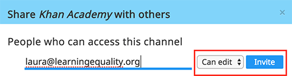
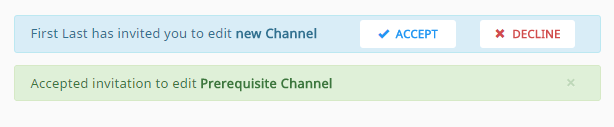

.. _share_channels:

Share Content Channels
######################

.. _invite_collaborators:

Invite Collaborators to View or Edit Content Channels
=====================================================

To allow others to view or edit your own content channels, or those that you can access in **View only** mode, follow these steps.

1. Open the channel that you want to share.

2. Click **Invite** button (|user| icon) from the :ref:`Edit Channel Content Toolbar <edit_content>`.

3. Type the email of the person you want to invite.

Select **Can view** or **Can edit** level of permission to grant them.

      Send email invite to collaborators.

When you invite collaborators to view or edit channels, they will be notified on their **My Channels** home page, where they can accept or reject the pending invitations. They will also receive an email allowing them to accept/reject the pending invitations.

   Accept or reject the pending invitations

.. note:: When you invite collaborators to view your channels, they will also be able to:
   
   * Invite others to view them.
   * Import content from them in their own channels.
   * Download the content items directly on their own devices (|download| icon).

   .. figure:: img/download-content.png
      :alt: Download content from view-only channels.

      Download content from view-only channels.

Make Content Channels Available for Import into Kolibri
=======================================================

**Channel ID/token** number is all you need to share the published channel with administrators at your facilities, or anybody in case you are releasing the channel as publicly available. There are 3 places where you can find and copy the channel ID/token:

-  Channel pane in the **My Channels** page

   .. figure:: img/channelID2.png
         :alt: Channel ID/token number in the My Channels page.

         Channel ID/token number in the My Channels page.

-  **Show ID** button on Edit Channel Content page

   .. figure:: img/channelID1.png
         :alt: Channel ID/token/token number in the Edit Channel Content page.

         Channel ID/token number in the Edit Channel Content page.

-  Channel published confirmation message

   .. figure:: img/channel-pubblished.png
         :alt: Channel ID/token number in the confirmation message.

         Channel ID/token number in the confirmation message.

.. tip:: Use the button/icon to easily copy the channel ID/token to your computer's clipboard, and send it by email.

Import Content Channels into Kolibri
************************************

Follow the instructions how to `import content channels into local installations of Kolibri <http://kolibri.readthedocs.io/en/latest/manage.html#import-content-into-kolibri>`_.