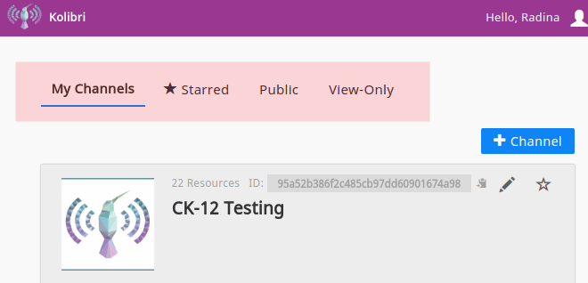
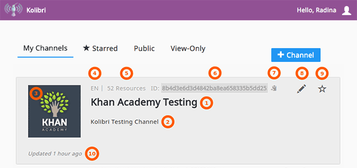
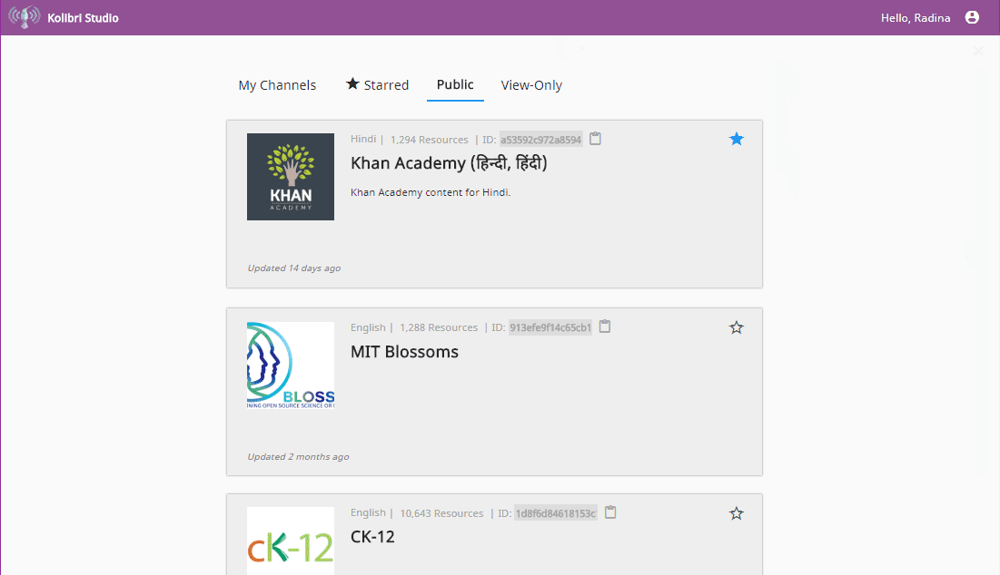
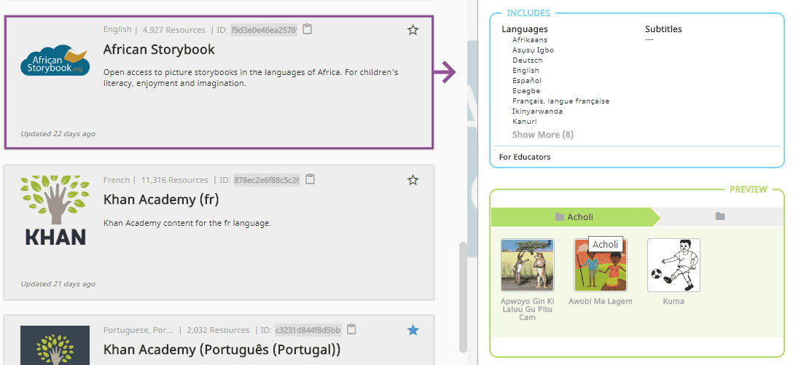
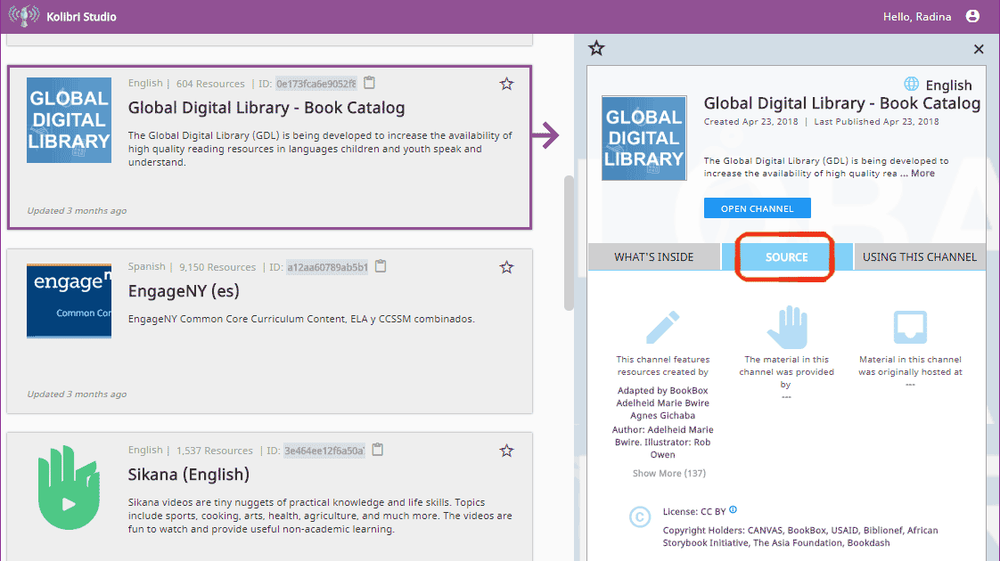

.. _work_channel:

Working with Channels
#####################

When you login to Kolibri Studio, you will be able to see Kolibri content channels organized in 4 different tab views:

#. :guilabel:`My Channels` tab with the list of channels you created previously, that you can update with the new materials if necessary, and publish again.

#. |star| :guilabel:`Starred` tab with the channels that you flagged for quick access.

#. :guilabel:`Public` tab with channels that the Learning Equality team made available from publicly available source content.

#. :guilabel:`View-Only` tab for channels for which you received an invitation to view by other Kolibri Studio users, and can import content from.

   Kolibri Studio content channels by type.

Channel Details
===============

In the main view you can see basic information for each of the channels:

   Basic channel information.

#.  Channel name
#.  Channel description
#.  Thumbnail image (optional)
#.  Channel language
#.  Number of resources (exercises, videos, audio or document files)
#.  Channel ID/token - `32 digit unique identifier <https://en.wikipedia.org/wiki/Universally_unique_identifier>`_ for each channel used for downloading and sharing content channels
#.  Copy the channel ID/token to the computer's clipboard ( |copy-c| icon)
#.  Star channel button (|star| icon)
#.  Latest update indicator

.. note:: The term **Channel ID** is valid for Kolibri versions up to 0.6, while from the Kolibri version 0.7 onward, we will start using exclusively the term **token** to uniquely designate each channel.

When you click on each of the channels from the list, panel with the extended channel information will open on the right.  

   Panel with extended channel information.

:guilabel:`What's inside` tab provides information about the type of resources channel contains (exercises, videos, HTML5 apps or documents), their number and storage required, as well as information about the languages offered and a preview of the topics included.

   Languages of the content included in the channel.

In the :guilabel:`Source` tab you can view information about content creators and license holders.

Open the :guilabel:`Using this channel` tab to copy the channel token that you need in order to import its content into Kolibri.

   Details about content creators, license and tokens for import.

.. tip:: Click the Kolibri icon in the upper left corner to return to **My Channels** page from any other section of the Kolibri Studio site.

Manage Content Channels
=======================

Create a New Channel
********************

To create a new content channel, follow these steps.

#. Click the :guilabel:`+ Channel` button.
#. Name the new channel and add a description.
#. Select the channel language from the dropdown selector.
#. Click on the default channel image (Kolibri logo), and upload an image for the thumbnail if desired (optional).
   
   .. figure:: img/add-thumb.png
      :alt: Change content channel thumbnail.

      Change content channel thumbnail.

#. Click :guilabel:`CREATE` to finish creating the channel, and the channel will be available in your **My Channels** list.

Now that you have created the content channel, :ref:`proceed to add and organize content in the channel <add_content>`.

Modify Channel Information
**************************

To modify the channel name, description or thumbnail follow these steps.

#. Click the channel you want to modify from the list in :guilabel:`My Channels` tab.
#. Click :guilabel:`EDIT DETAILS` inside the right side panel with extended channel information.

   .. figure:: img/edit-channel-details.png
      :alt: Modify content channel details.

      Modify content channel details.

#. Edit the desired details (title, description, language).
#. Click :guilabel:`SAVE` to finish or :guilabel:`CANCEL` to exit without modifying.

Delete Channel
**************

To permanently delete the channel follow these steps.

#. Click the channel you want to modify from the list in :guilabel:`My Channels` tab.

#. Scroll at the bottom of the :guilabel:`What's inside` tab in the right side panel.

#. Click :guilabel:`DELETE CHANNEL`. 

#. Read the browser warning message and click :guilabel:`DELETE CHANNEL` to confirm, or :guilabel:`CANCEL` to exit without deleting.
